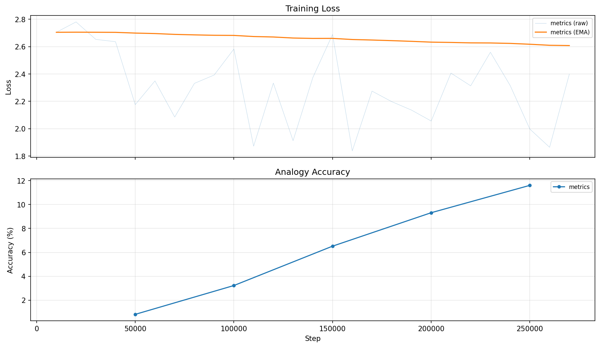

# tokvec 

A from-scratch implementation of word2vec SGNS trained on text8, with analytically derived gradients, PyTorch-oracle tests, and full training observability. Only NumPy is used for the core training logic, no PyTorch, TensorFlow, or other ML frameworks.

## Training Results



|  | Value |
|--|-------|
| **Dataset** | text8 (~17M words, vocab 71,290 after `min_count=5`) |
| **Hyperparameters** | 5 epochs, dim=100, lr=0.025 (linearly decaying), batch=512, K=5 negatives |
| **Final loss** | ~2.7 → ~2.0 (EMA) |
| **Analogy accuracy** | 0.8% → 11.6% on Google analogy dataset (3CosAdd) |

**Sample nearest neighbors** (step 250k):

| Query | Nearest Neighbors |
|-------|-------------------|
| computer | computers, automation, vlsi, firmware, supercomputers |
| paris | nantes, soir, cimeti, academie, rodin |
| king | highness, eochaid, mormaer, valois, canute |

**On the analogy score:** 11.6% with dim=100 and 5 epochs is expected for a small-scale run. The original paper reports ~50%+ with dim=300 and significantly longer training. Evaluation uses the Google analogy dataset (17,827 evaluable pairs across 14 categories) with the 3CosAdd method.

## Quick Start

One command to install dependencies, run tests, train, and visualize:

```bash
bash run.sh
```

Hyperparameters are configurable via environment variables:

```bash
EPOCHS=10 DIM=200 LR=0.025 BATCH=512 bash run.sh
```

**Manual alternative:**

```bash
uv sync                              # install dependencies
uv run pytest tests/ -v              # run all tests
uv run python train.py --help        # see all CLI flags
uv run python train.py               # train with defaults
```

**Prerequisites:** Python 3.10+ (tested on 3.12), [uv](https://docs.astral.sh/uv/). PyTorch is a dev-only dependency used exclusively for oracle testing — it is never imported by the implementation itself.

## Project Structure

```
src/
  data.py                — tokenization, vocab, subsampling, pair generation
  model.py               — SGNSModel (forward, gradients, update)
  negative_sampling.py   — O(1) noise-table sampler
  evaluate.py            — nearest neighbors, Google analogy eval
train.py                 — training loop with logging and periodic eval
visualize.py             — plot loss & analogy curves from metrics CSV
run.sh                   — one-command setup, test, train, and visualize
tests/                   — tests (finite-diff, PyTorch oracle, integration, benchmark)
logs/                    — training logs, metrics CSV, plots, checkpoints
data/                    — automatically downloaded on first run (text8, analogies)
```

## Gradient Derivation

SGNS loss per sample (one positive pair + K negative samples):

$$\mathcal{L} = -\log \sigma(\mathbf{v}_c \cdot \mathbf{u}_o) - \sum_{k=1}^{K} \log \sigma(-\mathbf{v}_c \cdot \mathbf{u}_k)$$

where $\mathbf{v}_c$ is the center word embedding, $\mathbf{u}_o$ is the context word embedding, and $\mathbf{u}_k$ are negative sample embeddings.

Since $\sigma'(x) = \sigma(x)(1 - \sigma(x))$, we get $\frac{d}{dx}\log \sigma(x) = 1 - \sigma(x)$. Applying this to each term:

$$\frac{\partial \mathcal{L}}{\partial \mathbf{v}_c} = (\sigma(s^+) - 1) \cdot \mathbf{u}_o + \sum_k \sigma(s_k^-) \cdot \mathbf{u}_k$$

$$\frac{\partial \mathcal{L}}{\partial \mathbf{u}_o} = (\sigma(s^+) - 1) \cdot \mathbf{v}_c$$

$$\frac{\partial \mathcal{L}}{\partial \mathbf{u}_k} = \sigma(s_k^-) \cdot \mathbf{v}_c$$

In practice, we compute the mean loss over a mini-batch of B samples, so all gradients are divided by B. The SGD update uses `lr × B`, which is mathematically equivalent to summing gradients with the base learning rate (i.e., per-sample SGD as in the original word2vec C implementation).

## Implementation Highlights

**PyTorch oracle testing** — PyTorch is used as a dev-only reference oracle. Each component (forward pass, gradients, optimizer step) is independently validated against `torch.autograd`, in addition to finite-difference gradient checks. This provides stronger correctness guarantees than numerical checks alone.

**O(1) negative sampling** — A 100M-entry noise table is pre-built from the unigram^(3/4) distribution. Sampling K negatives is a single random index lookup, giving O(1) time per sample versus O(V) for `np.random.choice` with a probability vector.

**Dense vs sparse gradient accumulation** — We benchmarked two approaches for gradient accumulation: `np.add.at` scatter-add on dense (V, D) arrays versus Python-loop dict-based accumulation. Results across 8 parameter configurations:

| V | B | K | dense (ms) | dict (ms) | Winner |
|---|---|---|-----------|----------|--------|
| 10k | 64 | 5 | 1.06 | 0.29 | dict (3.7x) |
| 10k | 64 | 15 | 1.38 | 0.70 | dict (2.0x) |
| 10k | 512 | 5 | 2.73 | 2.56 | tied |
| 10k | 512 | 15 | 5.60 | 6.59 | dense (1.2x) |
| 50k | 64 | 5 | 4.29 | 0.28 | dict (14x) |
| 50k | 64 | 15 | 4.70 | 0.71 | dict (6.7x) |
| 50k | 512 | 5 | 6.16 | 2.61 | dict (2.4x) |
| 50k | 512 | 15 | 9.47 | 6.87 | dict (1.4x) |

Dict wins 7/8 configurations. The dense approach pays for allocating the full V×D matrix each call, and `np.add.at` uses non-buffered scatter (no SIMD) to correctly handle duplicate indices. With a sparsity ratio of 0.006%–0.8%, the overhead of touching all V rows dominates. The current code uses `np.add.at` for readability.

**Training observability** — Every run produces a timestamped directory under `logs/` containing: metrics CSV (loss, lr, grad_norm per step), periodic analogy evaluation (`--eval-steps`), checkpoints (`--save-steps`), and a full training log. A `TeeLogger` writes to both stdout and file simultaneously.


## Debugging Notes

**Sigmoid overflow with `np.where`** — The "textbook" numerically stable sigmoid `np.where(x >= 0, 1/(1+exp(-x)), exp(x)/(1+exp(x)))` still produces overflow warnings and NaN. The reason: `np.where` eagerly evaluates *both* branches for all elements before selecting. For large negative `x`, `exp(-x)` overflows in the positive branch even though that branch won't be selected. Fix: use masked indexing to compute `exp` only on the relevant subset of elements.

**Gradient scaling bug (model not learning)** — The model appeared frozen: `gnorm ~0.001` across hundreds of thousands of steps. Root cause was three interrelated bugs: (a) the negative loss term used `.mean()` on shape (B, K), which averages over B×K instead of summing over K then averaging over B; (b) the gradient code divided negative terms by B×K to match the wrong loss; (c) the learning rate wasn't scaled for batch SGD (effective lr was `0.025/512 ≈ 0.00005`). Combined effect: gradients were ~2500× too small. Diagnosed by tracking `gnorm` in the training logs and tracing the normalization path end-to-end.

## References

1. Mikolov, T., Chen, K., Corrado, G., & Dean, J. (2013). *Efficient Estimation of Word Representations in Vector Space.* arXiv:1301.3781
2. Mikolov, T., Sutskever, I., Chen, K., Corrado, G., & Dean, J. (2013). *Distributed Representations of Words and Phrases and their Compositionality.* NeurIPS 2013
